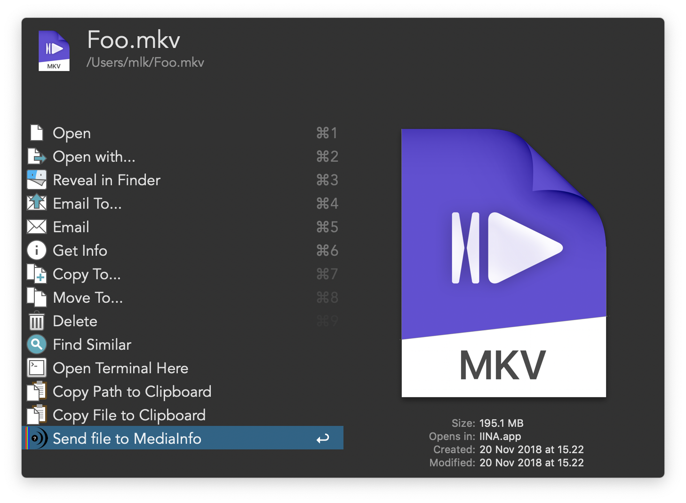

# MediaInfo Workflow for Alfred

This is an [Alfred][alfred] workflow for running the CLI version of
[MediaInfo][mediainfo]. Please note that you need to purchase the [Alfred
Powerpack][alfred-powerpack] to use this workflow.

## Features

This workflow contains a [File
Action](https://www.alfredapp.com/help/workflows/triggers/file-action/) that
processes video/movie files using `mediainfo`. The output is written to a `txt`
file in `/tmp`, which is then opened in your default editor.

## Installation

1. Download the [latest release][gh-latest-release] and import it into Alfred.
2. Install `mediainfo` in `/usr/bin/local/`.
   * If you're using Homebrew, `brew install mediainfo`.
   * If you have MediaInfo installed elsewhere on your system, you need to
     alter the `MEDIAINFO_BIN` workflow environment variable to contain the
     path to wherever your `mediainfo` binary is installed.

[alfred]: https://www.alfredapp.com
[mediainfo]: https://mediaarea.net/en/MediaInfo
[alfred-powerpack]: https://www.alfredapp.com/powerpack
[gh-latest-release]: https://github.com/sniarn/alfred-mediainfo-workflow/releases/latest
